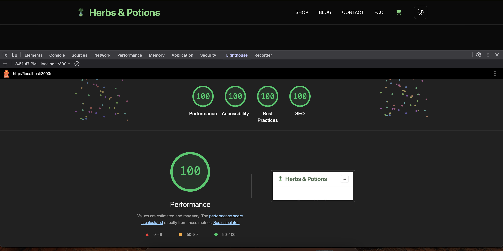
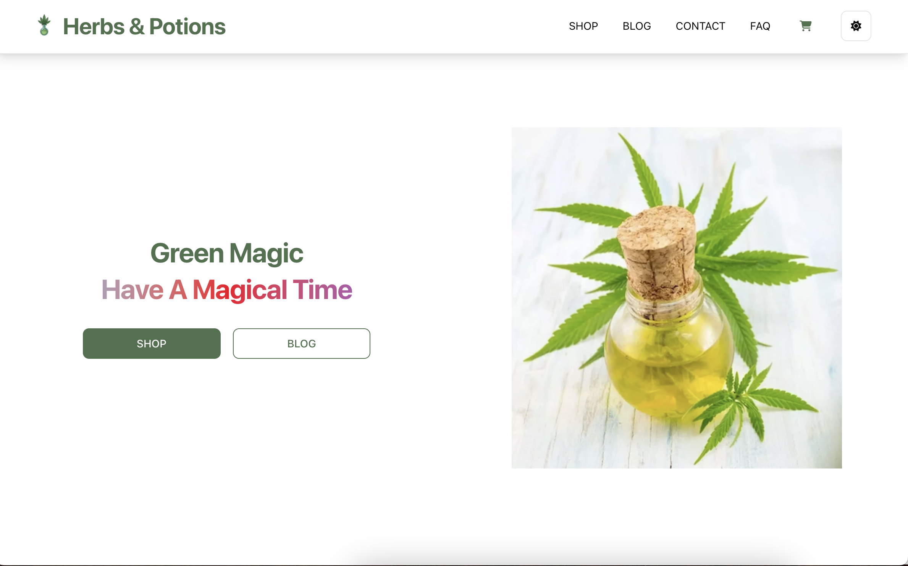
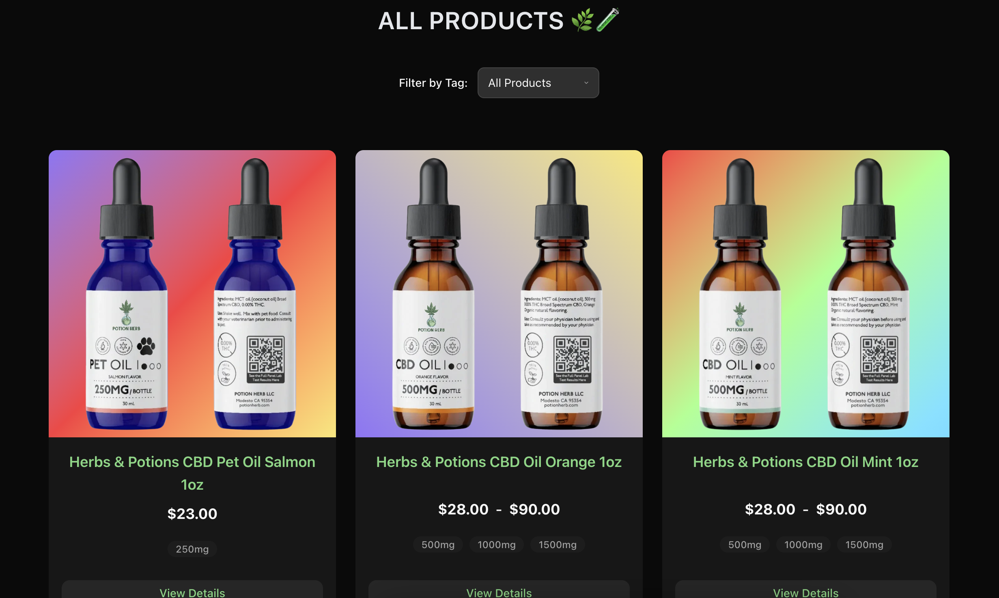
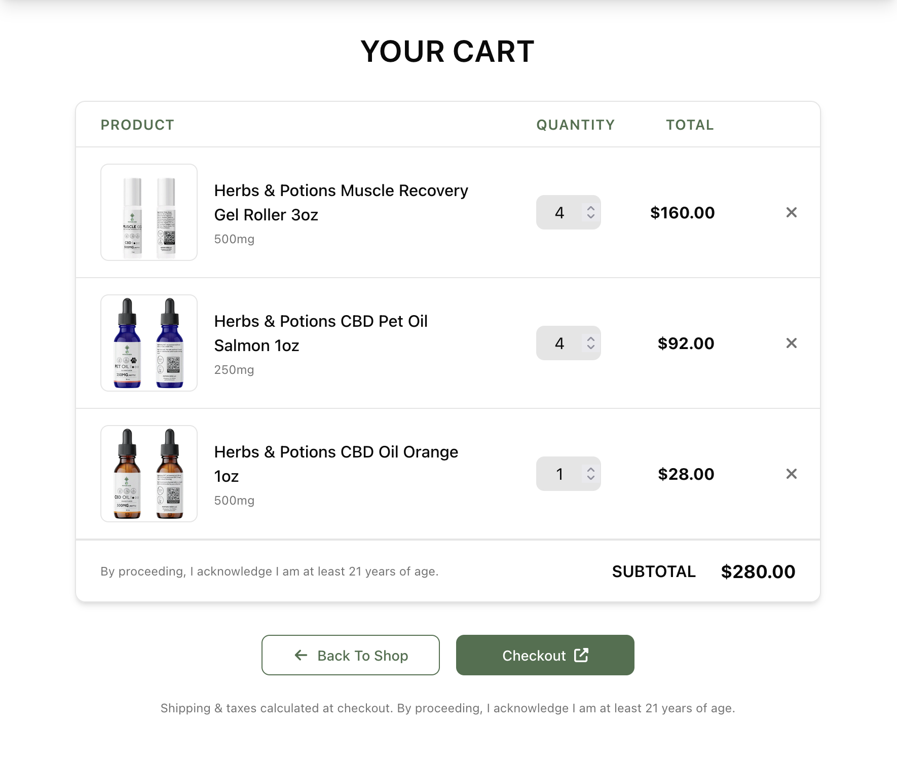

# Herbs & Potions - Next.js Shopify Storefront

A modern, headless e-commerce storefront built with Next.js, TypeScript, and Tailwind CSS, using the Shopify Storefront API as the backend for products, cart management, blog content, and as a headless CMS.

## Overview

This project serves as the customer-facing frontend for Herbs & Potions. It fetches product and content data directly from Shopify via its Storefront API, offering a fast, customizable user experience built with modern web technologies. It includes essential e-commerce features, a blog, content pages, and robust client-side functionality.







## Features

* **Framework:** Built with [Next.js](https://nextjs.org/) (App Router) for server-side rendering, static site generation, and client-side navigation.
* **Language:** Written in [TypeScript](https://www.typescriptlang.org/) for type safety and improved developer experience.
* **Headless Shopify:** Uses the [Shopify Storefront API](https://shopify.dev/docs/api/storefront) to fetch:
    * Products (listings, details, variants)
    * Collections
    * Blog Posts & Articles
    * Handles Cart creation and updates (or uses local storage for demo).
* **Styling:** Styled with [Tailwind CSS](https://tailwindcss.com/) utility classes.
* **UI Components:**
    * Custom reusable components, some of them using [shadcn/ui](https://ui.shadcn.com/).
    * Mobile navigation drawer implemented using [Headless UI](https://headlessui.com/) Dialog & Transition for CSP compliance.
* **Content Pages:** Includes Homepage, Shop (All Products), Product Detail Pages, Blog (All Posts), Blog Post Pages, Contact, FAQ.
* **E-commerce:**
    * Product Browse and filtering (example shows filtering by Tag on Shop page).
    * Client-side cart management using React Context.
* **Themeing:** Light/Dark mode toggle support (likely using `next-themes`).
* **Icons:** Uses [Font Awesome](https://fontawesome.com/) and [Lucide React](https://lucide.dev/) icons.
* **Age Gate:** Production-only modal requiring age verification (21+) for new visitors, using `localStorage`.
* **Accessibility:** Focus on accessible components (inherent in libraries like Headless UI).

## Tech Stack

* **Framework:** Next.js 14+ (App Router)
* **Language:** TypeScript
* **Styling:** Tailwind CSS
* **UI Primitives/Components:** React, Headless UI, Lucide React
* **Icons:** Font Awesome
* **Backend/CMS:** Shopify Storefront API (GraphQL)
* **State Management:** React Context API, React Hooks (`useState`, `useEffect`, `useRef`)
* **Package Manager:** npm or yarn

## Getting Started

### Prerequisites

* Node.js (v20.x or later recommended)
* npm or yarn
* Access to a Shopify store with the Storefront API enabled.
* Shopify Storefront API Access Token (Public) with necessary permissions (read products/content, write checkouts).

### Installation

1.  **Clone the repository:**
    ```bash
    git clone <your-repository-url>
    cd <repository-directory>
    ```
2.  **Install dependencies:**
    ```bash
    npm install
    # or
    yarn install
    ```
3.  **Set up Environment Variables:**
    Create a `.env.local` file in the root of the project. Add the necessary Shopify credentials and other environment variables. See the `.env.example` file (if provided) or the section below for required variables.

### Environment Variables

Create a `.env.local` file in the project root and add the following variables:

```plaintext
# Required: Your Shopify store domain (e.g., your-store-name.myshopify.com)
NEXT_PUBLIC_SHOPIFY_STORE_DOMAIN=your-store-name.myshopify.com

# Required: Your PUBLIC Storefront API access token (create via Shopify Admin > Apps > Develop apps > Create app)
# Ensure this token has permissions for products, collections, cart/checkouts (write), blog posts etc.
NEXT_PUBLIC_SHOPIFY_STOREFRONT_ACCESS_TOKEN=your_public_storefront_api_token

# Required: Your site's full production URL (used for metadataBase)
NEXT_PUBLIC_SITE_URL=[https://yoursite.com](https://yoursite.com)

Important: Ensure your Storefront API access token has the necessary permissions (e.g., unauthenticated_read_product_listings, unauthenticated_read_content, unauthenticated_write_checkouts, etc.) configured in your Shopify custom app settings.

Using Your Own Shopify Data (Products & Posts)

This project includes static fallback data files for products and blog posts (e.g., in lib/posts.ts and lib/products.ts or similar paths) which are used if the live Shopify API fetch fails or for certain build processes like sitemap generation. This data is structured as arrays of objects and is now part of the repository.

You have two main options for managing your data:

    Fetch Live Data from Shopify API (Recommended for Production):
        Ensure your .env.local variables are correctly set up (see above).
        Verify the data fetching functions (likely located in lib/shopifyProducts.ts and lib/shopifyPosts.ts) are configured to actively fetch data using the Shopify Storefront API client. These functions may already include logic to use the static data as a fallback, but ensure the primary fetch mechanism is enabled for live data.

    Replace Fallback Static Data:
        If you prefer to rely primarily on static data or want to update the fallback data used when the API fails, locate the existing static data files (e.g., lib/posts.ts and lib/products.ts - check your specific project structure).
        Replace the content within these files with your actual product and post data.
        Crucially, you must maintain the exact same TypeScript type structure and property names as the original objects within the arrays.
        Update any relative image paths within the data if necessary. Since these files are now part of the repository, simply editing them will use your data as the fallback.

Enabling Live Shopify Cart & Checkout

By default, the cart might use local storage only for demo purposes. To enable full Shopify checkout functionality (check your specific implementation):

    Modify Cart Context (StoreContext.tsx or similar):
        Review the context file for logic related to live Shopify checkouts vs. demo functionality. Ensure the code responsible for creating/updating Shopify checkouts and retrieving the checkoutUrl is active, and any demo-only logic is commented out or removed.
        Ensure the CartContextType definition includes the checkoutUrl.
        Ensure the useCartContext hook returns the checkoutUrl.
    Modify Cart Page (CartPage.tsx or similar):
        Ensure the "Checkout" button uses the checkoutUrl obtained from the context (e.g., an <a> tag with href={checkoutUrl}) and that any demo checkout buttons/modals are disabled or removed.
        Make sure the component correctly destructures checkoutUrl from useCartContext.
    Test Thoroughly: After making changes, test adding items, updating quantities, and clicking the checkout button to ensure it redirects correctly to the Shopify checkout page.

Usage
Running the Development Server
Bash

npm run dev
# or
yarn dev

Open http://localhost:3000 with your browser to see the result. The application will automatically reload upon code changes. The Age Gate modal will likely be skipped in development mode.
Building for Production
Bash

npm run build
# or
yarn build

This command builds the application for production usage, generating static files and serverless functions.
Running the Production Build Locally

To test the production build on your local machine:
Bash

npm run start
# or
yarn start

This serves the optimized production build from the .next folder. Open http://localhost:3000. The Age Gate modal should be active in this mode.
Deployment

Deploy the application to a platform that supports Next.js (like Vercel, Netlify, AWS Amplify, etc.). Ensure you configure the required Environment Variables (Shopify domain and Storefront token) in your hosting provider's settings. Vercel is recommended for seamless Next.js deployments.